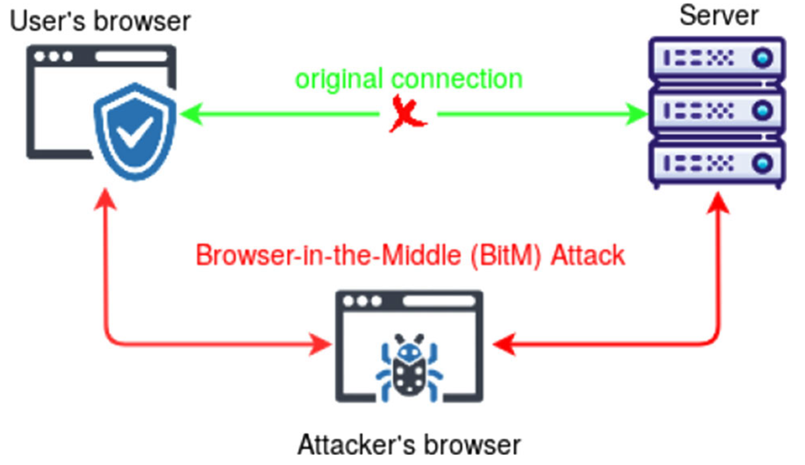
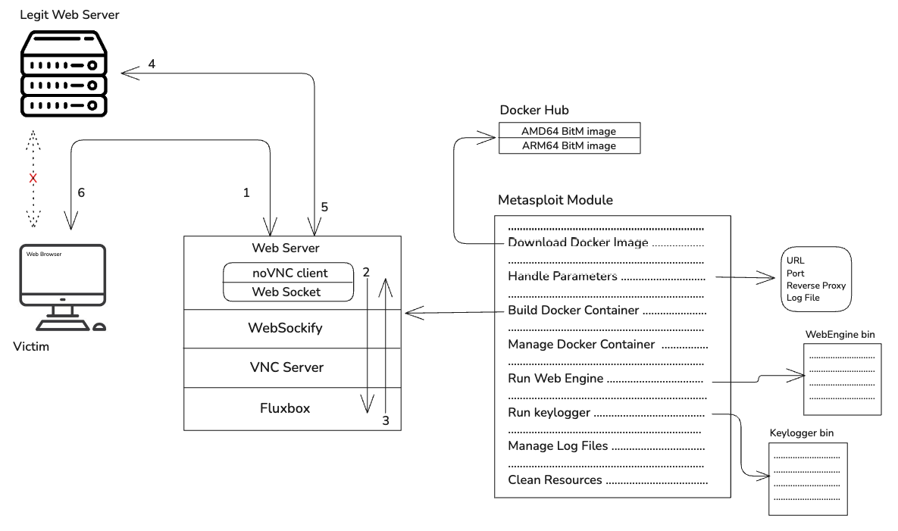
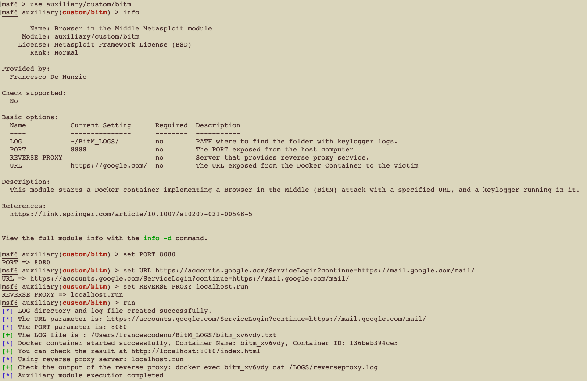
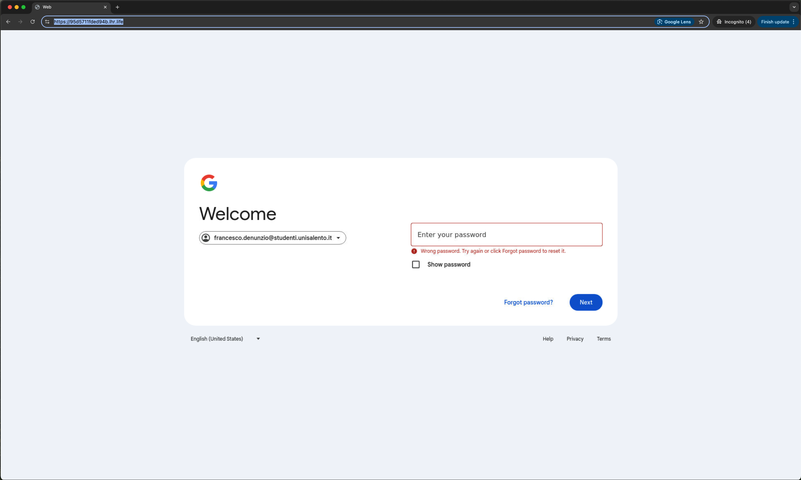

# Browser-in-the-Middle Attack Implementation


This project is a working implementation of the **Browser-in-the-Middle (BitM) attack** as described in the paper:

> [Browser-in-the-Middle: Security and Privacy Issues of a Novel Proxy-Based Web Attack](https://link.springer.com/article/10.1007/s10207-021-00548-5)  
> **Franco Tommasi, Christian Catalano, Ivan Taurino**, 2022.



---

## How it works

In few words... 
BitM is a proxy-based attack where the attacker hosts a malicious server that displays a live session of the target web application using a browser (in this case, noVNC). The victim believes they are interacting directly with the legitimate site, but in reality, they are navigating the attacker's remote-controlled browser.
This setup gives the attacker full visibility and control over the session. In this implementation, a keylogger is embedded on the attacker's server to capture all user inputs.

A schema of the architecture and the attack flow is shown below:



---

## Usage

The core of the attack is implemented entirely within a Docker container. Additionally, a Metasploit module has been provided to automate the orchestration of these containers.

### Option 1: Using Metasploit

1. Clone the repo and copy the Metasploit module to your Metasploit path.
2. Start `msfconsole` and load the module.
3. Configure the required options (target URL, proxy settings, etc.).
4. Run the module — it will build and launch the Docker container.



### Option 2: Running the Docker Container Directly

1. Build the container:
   ```bash
   docker build -t bitm .
   docker run -p 8080:8080 bitm
      ```
## Results


